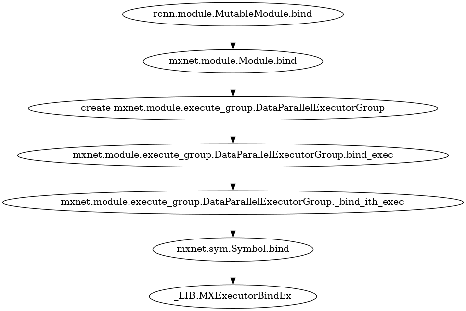

<!-- START doctoc generated TOC please keep comment here to allow auto update -->
<!-- DON'T EDIT THIS SECTION, INSTEAD RE-RUN doctoc TO UPDATE -->
**Table of Contents**  *generated with [DocToc](https://github.com/thlorenz/doctoc)*

- [开启训练](#%E5%BC%80%E5%90%AF%E8%AE%AD%E7%BB%83)
  - [fit 逻辑](#fit-%E9%80%BB%E8%BE%91)
  - [fit中的重要逻辑](#fit%E4%B8%AD%E7%9A%84%E9%87%8D%E8%A6%81%E9%80%BB%E8%BE%91)

<!-- END doctoc generated TOC please keep comment here to allow auto update -->

# 开启训练

## fit 逻辑

## fit中的重要逻辑

**注意：下面的标题中的数字对应于上图中的数字。**

**1.bind symbol 到 executor**

因为使用了数据并行的方式，多个GPU执行同一个symbol的逻辑，每个GPU都有一个executor与他相对应。下图是具体的函数调用关系。

**2.初始化executor参数**

把argument param/auxiliary param复制到executor的函数调用关系。

**9.forward**

前向逻辑的函数调用关系。

**10.backward**

后向逻辑的函数调用关系。

